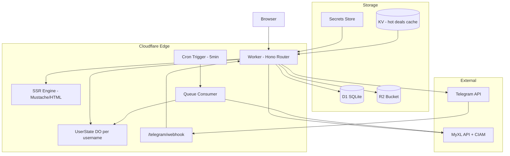
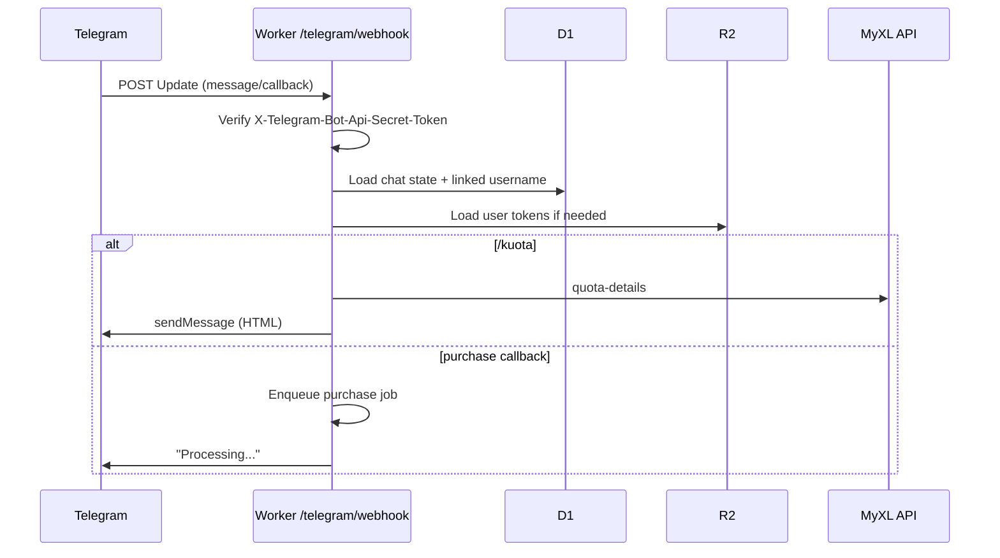
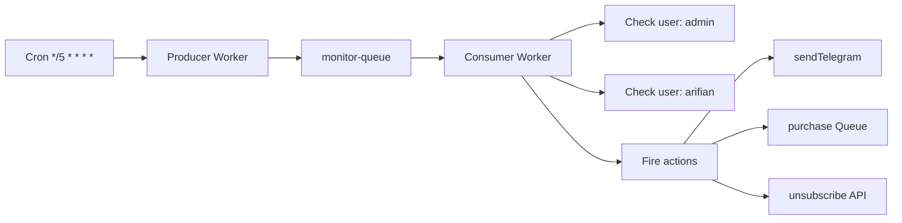

# WebUI-XL → Cloudflare Workers Migration

| Field | Value |
|-------|-------|
| **Status** | Draft |
| **Date** | 2026-06-13 |
| **Author** | TBD |
| **Project** | me-cli-sunset / WebUI-XL |
| **Repo** | `arifianilhamnrr/me-cli-sunset` |

---

## Overview

WebUI-XL is a multi-tenant FastAPI application (`run-web.py` → `webui/app.py`) that manages MyXL accounts via a server-rendered web UI (Jinja2 + HTMX + Tailwind), a Telegram bot (long-polling), and a background quota monitor. Today it runs on a VPS with file-based persistence (`webui_data/`) and optional Cloudflare Tunnel as a reverse proxy — **not** as a CF Worker.

This document defines a **two-runtime migration**: Phase 1 refactors the Python app for portable dev (GitHub Codespaces + SQLite); Phase 2 rewrites the runtime to **Cloudflare Workers** (TypeScript + Hono) with **D1 + R2 + Durable Objects + Queues + Cron Triggers**, preserving **full feature parity** and **server-rendered HTML**.

---

## Background & Motivation

### Current state

```
Browser ──► cloudflared (optional) ──► VPS:8089 (uvicorn)
                                         ├── FastAPI routes (~50)
                                         ├── TelegramBot (long-poll thread)
                                         ├── monitor_loop (asyncio, 5 min)
                                         └── webui_data/ (per-user files)
```

| Pain point | Impact |
|------------|--------|
| VPS coupling | Manual deploy, systemd port conflicts, single point of failure |
| File-based state + singletons | Not portable to edge; race risk under concurrency |
| `os.chdir()` legacy + ContextVar hybrid | Fragile in cloud dev environments |
| Long-polling Telegram | Cannot run on CF Workers (no persistent process) |
| pycryptodome | Blocks direct Python-on-Workers path |
| No devcontainer | Codespaces requires manual setup |

### Target state

```
Browser ──► CF DNS ──► Worker (Hono SSR + HTMX)
                         ├── D1 (users, sessions, rules, metadata)
                         ├── R2 (tokens, bookmarks, decoy, quota cache)
                         ├── Durable Objects (per-user state, purchase sessions)
                         ├── Queues (async purchase / monitor jobs)
                         ├── Cron Trigger (monitor loop)
                         └── Telegram webhook POST /telegram/webhook

Dev: GitHub Codespaces ──► Python refactor (SQLite backend) ──► same routes, portable
```

---

## Goals & Non-Goals

### Goals

- **G1**: Full feature parity v1 — all 50+ routes, Telegram commands, monitoring rules, decoy, family-loop SSE, purchase methods
- **G2**: Server-rendered HTML preserved — port Jinja2 templates to Workers-compatible SSR (not SPA)
- **G3**: Dev in GitHub Codespaces with one-click setup (`.devcontainer/`)
- **G4**: Production on CF Workers edge — no VPS dependency after cutover
- **G5**: Storage: SQLite (Phase 1 dev) → D1 + R2 (Phase 2 prod)
- **G6**: Telegram via **webhook** on Worker
- **G7**: Crypto/signing byte-verified against Python reference implementation
- **G8**: Data migration path from `webui_data/` → D1 + R2

### Non-Goals

- **NG1**: CLI mode (`main.py`) on CF Workers — stays Python/local only
- **NG2**: CF Workers Python runtime (Pyodide) — insufficient for pycryptodome + FastAPI
- **NG3**: SPA rewrite (React/Vue) — explicit user decision to keep SSR
- **NG4**: Multi-region active-active in v1 — single CF account, D1 primary region OK
- **NG5**: Horizontal scale beyond ~50 concurrent users in v1 — personal/small-team scale

---

## Proposed Design

### High-level architecture



### Runtime split

| Layer | Phase 1 (Python) | Phase 2 (Workers) |
|-------|------------------|-------------------|
| HTTP | FastAPI + uvicorn | Hono on Workers |
| Templates | Jinja2 | Mustache (or `@worker-tools/html`) — port all 35 templates |
| HTMX | Unchanged in HTML | Unchanged |
| Storage | `SQLiteBackend` | `D1R2Backend` implementing same interface |
| Crypto | pycryptodome | `src/crypto/` Web Crypto module |
| Telegram | Long-poll (optional) | Webhook handler |
| Monitor | asyncio loop (optional) | Cron → Queue → Worker |

---

## Storage Design

### Storage abstraction (Phase 1 — enables both phases)

```typescript
// Conceptual interface — implement in Python (Phase 1) and TypeScript (Phase 2)
interface StorageBackend {
  // WebUI users
  getUser(username: string): Promise<WebUIUser | null>
  listUsers(): Promise<WebUIUser[]>
  createUser(username: string, passwordHash: string): Promise<void>
  updateUser(username: string, patch: Partial<WebUIUser>): Promise<void>

  // Per-user blobs (R2 in prod, BLOB table or files in SQLite dev)
  getBlob(user: string, key: BlobKey): Promise<string | null>
  putBlob(user: string, key: BlobKey, data: string): Promise<void>
  deleteBlob(user: string, key: BlobKey): Promise<void>
  listBlobs(user: string, prefix: string): Promise<string[]>

  // Global config
  getGlobalConfig(key: string): Promise<string | null>
  putGlobalConfig(key: string, data: string): Promise<void>
}

type BlobKey =
  | 'refresh-tokens.json'
  | 'active.number'
  | 'ax.fp'
  | 'bookmark.json'
  | 'monitoring.json'
  | 'quota_cache.json'
  | 'telegram.json'
  | `decoy_data/${string}`
```

**Python location:** `webui/storage/` — new package  
**Removes:** all direct `open()`, `os.chdir()`, `resolve_path()` calls in routes

### D1 schema (Phase 2 production)

```sql
-- WebUI account registry (replaces webui_data/users.json)
CREATE TABLE webui_users (
  username        TEXT PRIMARY KEY,
  password_hash   TEXT NOT NULL,          -- pbkdf2_sha256$200000$...
  created_at      INTEGER NOT NULL,       -- unix epoch
  theme           TEXT DEFAULT 'dark',    -- 'dark' | 'light'
  telegram_chat_id INTEGER,              -- nullable
  updated_at      INTEGER NOT NULL
);

CREATE INDEX idx_webui_users_telegram ON webui_users(telegram_chat_id);

-- Session secret metadata (actual secret in CF Secrets Store)
CREATE TABLE session_config (
  id              INTEGER PRIMARY KEY CHECK (id = 1),
  secret_version  INTEGER NOT NULL DEFAULT 1,
  rotated_at      INTEGER NOT NULL
);

-- Global Telegram bot config (replaces webui_data/telegram.json)
CREATE TABLE telegram_config (
  id                      INTEGER PRIMARY KEY CHECK (id = 1),
  bot_token_ref           TEXT NOT NULL,   -- CF secret name, not plaintext
  enabled                 INTEGER NOT NULL DEFAULT 0,
  daily_summary_enabled   INTEGER NOT NULL DEFAULT 1,
  daily_summary_hour      INTEGER NOT NULL DEFAULT 7,
  daily_summary_minute    INTEGER NOT NULL DEFAULT 0,
  low_quota_threshold_pct INTEGER NOT NULL DEFAULT 10,
  poll_interval_minutes   INTEGER NOT NULL DEFAULT 5,
  webhook_secret          TEXT,            -- Telegram webhook verification
  updated_at              INTEGER NOT NULL
);

-- Monitoring rules (denormalized from monitoring.json for queryability)
CREATE TABLE monitoring_rules (
  id                TEXT PRIMARY KEY,      -- uuid
  username          TEXT NOT NULL REFERENCES webui_users(username) ON DELETE CASCADE,
  name              TEXT NOT NULL,
  msisdn            TEXT NOT NULL,
  match_json        TEXT NOT NULL,         -- JSON: filter criteria
  trigger_json      TEXT NOT NULL,         -- JSON: threshold config
  actions_json      TEXT NOT NULL,         -- JSON: [{type, ...}]
  cooldown_seconds  INTEGER NOT NULL DEFAULT 3600,
  enabled           INTEGER NOT NULL DEFAULT 1,
  last_fired_at     INTEGER,
  last_status       TEXT,
  last_msg          TEXT,
  created_at        INTEGER NOT NULL,
  updated_at        INTEGER NOT NULL
);

CREATE INDEX idx_rules_user ON monitoring_rules(username);
CREATE INDEX idx_rules_enabled ON monitoring_rules(enabled);

-- OTP flow state (replaces in-memory _otp_state in routes/auth.py)
CREATE TABLE otp_sessions (
  phone             TEXT PRIMARY KEY,
  subscriber_id     TEXT NOT NULL,
  created_at        INTEGER NOT NULL,
  expires_at        INTEGER NOT NULL
);

-- Telegram bot in-memory state persistence (replaces _states dict)
CREATE TABLE telegram_chat_state (
  chat_id           INTEGER PRIMARY KEY,
  username          TEXT REFERENCES webui_users(username) ON DELETE SET NULL,
  step              TEXT,
  data_json         TEXT DEFAULT '{}',
  active_msisdn     TEXT,
  account_msisdn    TEXT,
  pkg_map_json      TEXT DEFAULT '{}',
  unsub_map_json    TEXT DEFAULT '{}',
  updated_at        INTEGER NOT NULL
);

CREATE TABLE telegram_pending_confirm (
  chat_id           INTEGER PRIMARY KEY,
  confirm_type      TEXT NOT NULL,
  payload_json      TEXT NOT NULL,
  expires_at        INTEGER NOT NULL
);

-- Audit / error log (replaces webui-errors.log)
CREATE TABLE error_log (
  id                INTEGER PRIMARY KEY AUTOINCREMENT,
  created_at        INTEGER NOT NULL,
  username          TEXT,
  route             TEXT,
  method            TEXT,
  message           TEXT NOT NULL,
  stack             TEXT
);

CREATE INDEX idx_error_log_created ON error_log(created_at);

-- R2 object index (optional — for listing without R2 list ops)
CREATE TABLE r2_objects (
  username          TEXT NOT NULL,
  object_key        TEXT NOT NULL,
  size_bytes        INTEGER,
  updated_at        INTEGER NOT NULL,
  PRIMARY KEY (username, object_key)
);
```

### R2 key structure

```
Bucket: webui-xl-data

# Per-user blobs (mirror current webui_data/users/{username}/)
users/{username}/refresh-tokens.json
users/{username}/active.number
users/{username}/ax.fp
users/{username}/bookmark.json
users/{username}/quota_cache.json
users/{username}/monitoring.json          # deprecated after D1 rules migration
users/{username}/telegram.json            # deprecated after D1 chat_id column
users/{username}/decoy_data/decoy-default-balance.json
users/{username}/decoy_data/decoy-prio-qris.json
users/{username}/decoy_data/custom-{name}.json

# Shared static data
shared/hot.json
shared/hot2.json
shared/decoy-templates/decoy-default-balance.json
...

# Purchase job artifacts (async flows)
jobs/purchase/{job_id}/status.json
jobs/purchase/{job_id}/result.json

# Migration snapshots
migration/{timestamp}/manifest.json
migration/{timestamp}/users/{username}.tar.gz
```

**Estimated storage:** ~100 KB per active user → 50 users ≈ 5 MB (negligible on R2)

---

## Worker Project Structure

```
me-cli-sunset/
├── worker/                          # Phase 2 — CF Worker (TypeScript)
│   ├── wrangler.toml
│   ├── package.json
│   ├── src/
│   │   ├── index.ts                 # Hono app entry
│   │   ├── env.d.ts                 # Bindings types
│   │   ├── crypto/
│   │   │   ├── crypto-helper.ts     # Port of app/service/crypto_helper.py
│   │   │   ├── encrypt.ts           # Port of app/client/encrypt.py
│   │   │   └── __tests__/           # Byte-compare vs Python vectors
│   │   ├── clients/
│   │   │   ├── ciam.ts
│   │   │   ├── engsel.ts
│   │   │   ├── famplan.ts
│   │   │   ├── circle.ts
│   │   │   ├── store.ts
│   │   │   ├── registration.ts
│   │   │   └── purchase/
│   │   │       ├── balance.ts
│   │   │       ├── qris.ts
│   │   │       └── ewallet.ts
│   │   ├── storage/
│   │   │   ├── d1.ts
│   │   │   ├── r2.ts
│   │   │   └── backend.ts           # StorageBackend impl
│   │   ├── routes/                  # Mirror webui/routes/*.py
│   │   │   ├── webui-auth.ts
│   │   │   ├── dashboard.ts
│   │   │   ├── auth.ts
│   │   │   ├── packages.ts
│   │   │   ├── purchase.ts
│   │   │   ├── ...
│   │   │   └── donasi.ts
│   │   ├── telegram/
│   │   │   ├── webhook.ts
│   │   │   ├── commands.ts
│   │   │   └── callbacks.ts
│   │   ├── monitor/
│   │   │   ├── cron.ts
│   │   │   ├── evaluator.ts
│   │   │   └── actions.ts
│   │   ├── durable-objects/
│   │   │   └── user-state.ts        # Per-username DO
│   │   ├── queue/
│   │   │   └── purchase-consumer.ts
│   │   ├── ssr/
│   │   │   ├── engine.ts            # Mustache render + filters
│   │   │   ├── filters.ts           # rp, ts, date, bytes, safe_html
│   │   │   └── templates/           # Ported from webui/templates/
│   │   └── middleware/
│   │       ├── session.ts
│   │       └── user-context.ts
│   └── static/                      # Served via Workers Assets or R2
│       ├── css/custom.css
│       └── js/msisdn-toggle.js
├── webui/storage/                   # Phase 1 — Python storage abstraction
│   ├── __init__.py
│   ├── backend.py                   # StorageBackend ABC
│   ├── sqlite_backend.py
│   └── file_backend.py              # Legacy adapter for migration
├── .devcontainer/
│   ├── devcontainer.json
│   └── post-create.sh
├── scripts/
│   ├── migrate-to-d1-r2.py
│   └── crypto-vectors/              # Shared test vectors Python + TS
└── docs/
    └── DESIGN-cf-worker-migration.md
```

### wrangler.toml bindings (sketch)

```toml
name = "webui-xl"
main = "worker/src/index.ts"
compatibility_date = "2026-06-01"

[assets]
directory = "worker/static"
binding = "ASSETS"

[[d1_databases]]
binding = "DB"
database_name = "webui-xl"
database_id = "<generated>"

[[r2_buckets]]
binding = "DATA"
bucket_name = "webui-xl-data"

[[kv_namespaces]]
binding = "KV"
id = "<generated>"

[[queues.producers]]
binding = "PURCHASE_QUEUE"
queue = "purchase-jobs"

[[queues.consumers]]
queue = "purchase-jobs"
max_batch_size = 1
max_retries = 3

[durable_objects]
bindings = [
  { name = "USER_STATE", class_name = "UserState" }
]

[[migrations]]
tag = "v1"
new_classes = ["UserState"]

[triggers]
crons = ["*/5 * * * *"]

[vars]
ENVIRONMENT = "production"
```

---

## SSR Strategy on Workers

### Approach: Mustache + pre-rendered partials

Jinja2 templates (`webui/templates/`, 35 files) port to **Mustache** syntax — 90% compatible for this project's templates (loops, conditionals, variables). HTMX attributes stay verbatim in HTML.

| Jinja2 | Mustache |
|--------|----------|
| `` | `{{#x}}` |
| `` | `{{#items}}` |
| `{{ value \| rp }}` | Custom filter in `engine.ts` pre-processing |
| `` | Compose via `renderLayout(template, body)` |

**Filter port** (`webui/app.py` lines 127-132):

```typescript
// worker/src/ssr/filters.ts
export const filters = {
  rp: (n: number) => new Intl.NumberFormat('id-ID', { style: 'currency', currency: 'IDR', minimumFractionDigits: 0 }).format(n),
  ts: (epoch: number) => formatWIB(epoch),
  date: (iso: string) => formatDate(iso),
  iso_date: (iso: string) => iso?.slice(0, 10) ?? '',
  bytes: humanizeBytes,
  safe_html: (s: string) => s, // already escaped at source
};
```

**Layout pattern:**

```typescript
export async function render(request: Request, template: string, ctx: Record<string, unknown>): Promise<Response> {
  const body = await engine.render(template, { ...ctx, ...await loadUserContext(request) });
  const html = await engine.render('base', { ...ctx, content: body, title: ctx.title });
  return new Response(html, { headers: { 'Content-Type': 'text/html; charset=utf-8' } });
}
```

**Static assets:** CF Workers Assets binding for `/static/css/custom.css`, `/static/js/msisdn-toggle.js`. Tailwind + HTMX + Font Awesome remain CDN (same as today).

---

## Crypto Port Plan

### Scope

All functions in `app/service/crypto_helper.py` and `app/client/encrypt.py` must produce **identical output** to Python for the same inputs.

| Python function | Web Crypto equivalent |
|-----------------|----------------------|
| `encrypt_xdata` / `decrypt_xdata` | AES-CBC, key from `XDATA_KEY`, IV = SHA256(xtime_ms)[0:16] |
| `make_x_signature` | HMAC-SHA512, `X_API_BASE_SECRET` |
| `make_x_signature_payment` | HMAC-SHA512 |
| `make_ax_api_signature` | HMAC-SHA256 → base64 |
| `encrypt_circle_msisdn` | AES-CBC, `ENCRYPTED_FIELD_KEY` |
| `ax_fingerprint` | AES-CBC, `AX_FP_KEY` |
| `ax_device_id` | MD5(ax.fp blob) — use subtle.digest or md5 lib |

### Verification strategy

1. **Golden vectors:** Python script dumps 50+ input/output pairs per function → `scripts/crypto-vectors/vectors.json`
2. **CI gate:** `worker/src/crypto/__tests__/` runs in `vitest`; must match vectors
3. **Live smoke:** Codespaces runs both Python and TS against sandbox MSISDN (read-only endpoints only)
4. **Gate criterion:** 100% vector pass before Phase 2 route port begins

### Secrets (CF Secrets Store)

All env vars from `.env.template` become Worker secrets — never in `wrangler.toml` plaintext:

`BASE_API_URL`, `BASE_CIAM_URL`, `BASIC_AUTH`, `UA`, `API_KEY`, `AES_KEY_ASCII`, `AX_FP_KEY`, `AX_FP`, `ENCRYPTED_FIELD_KEY`, `XDATA_KEY`, `AX_API_SIG_KEY`, `X_API_BASE_SECRET`, `SESSION_SECRET`

---

## Telegram Webhook Architecture

### Migration: long-poll → webhook



**Setup on deploy:**

```bash
curl "https://api.telegram.org/bot{TOKEN}/setWebhook" \
  -d "url=https://webui-xl.example.com/telegram/webhook" \
  -d "secret_token={WEBHOOK_SECRET}"
```

**Command parity** (from `webui/telegram_bot.py`):

| Command | Handler port |
|---------|---------------|
| `/start`, `/help` | `telegram/commands.ts` |
| `/link`, `/unlink` | D1 `webui_users` + `telegram_chat_state` |
| `/nomor` | Inline keyboard → R2 `active.number` |
| `/kuota`, `/saldo`, `/paket` | `engsel.ts` |
| `/beli`, `/unsub`, `/history`, `/menu` | callbacks in `telegram/callbacks.ts` |
| Purchase wizard callbacks | `purchase:` prefix → Queue for long ops |

**State:** `telegram_chat_state` + `telegram_pending_confirm` in D1 (replaces `_states` / `_pending_confirm` in-memory dicts). TTL cleanup via Cron.

---

## Monitor Architecture

### Cron Trigger (replaces `monitor_loop.py`)



**Per-user check** (port of `_check_user_once`):

1. Load rules from D1 `monitoring_rules` WHERE `username = ? AND enabled = 1`
2. For each rule MSISDN: load tokens from R2, call `quota-details`
3. Update R2 `quota_cache.json`
4. Evaluate match + trigger + cooldown (port `_quota_metric_value`, `_matches_filter`, `_cmp`)
5. Execute actions: `telegram`, `buy_option`, `unsubscribe`
6. Update `last_fired_at`, `last_status` in D1

**Daily summary:** Cron at configured hour (from `telegram_config`) — separate scheduled handler.

**Manual trigger:** `POST /monitoring/run-once` enqueues immediate check for current user.

---

## Purchase Flow & CPU Timeout Mitigation

CF Workers have CPU limits (~30s wall on paid). Purchase flows (`settlement_balance`, `settlement_qris`, decoy variants) can be slow.

### Pattern: synchronous fast path + Queue async path

| Flow | Strategy |
|------|----------|
| Simple balance purchase (< 10s typical) | Inline in Worker request |
| QRIS / e-wallet / decoy | Enqueue → `purchase-queue` → Consumer Worker |
| Family-loop SSE | **Durable Object** streams events to client |

**Family-loop SSE** (replaces `GET /purchase/family-loop/stream`):

```typescript
// Durable Object holds iteration state, yields SSE events
export class FamilyLoopDO {
  async fetch(request: Request) {
    const { readable, writable } = new TransformStream();
    // async loop: try each family option, write SSE events
    return new Response(readable, {
      headers: { 'Content-Type': 'text/event-stream', 'Cache-Control': 'no-cache' },
    });
  }
}
```

Client HTMX SSE extension (`htmx.ext.sse.js`) — already in `base.html` — unchanged.

**Job status polling:** HTMX `hx-trigger="every 2s"` on `purchase_result.html` partial for async jobs.

---

## Session & Auth

### WebUI session (unchanged semantics)

- Cookie: `mecli_session` (port from `webui/users.py`)
- Signing: HMAC via `itsdangerous` equivalent — `@hono/session` or custom `crypto.subtle` HMAC
- Secret: CF Secrets Store `SESSION_SECRET` (migrate from `webui_data/session.secret`)
- Password: PBKDF2-HMAC-SHA256, 200k iterations — use `crypto.subtle.deriveBits`

### MyXL OTP session

- `otp_sessions` table in D1 (5 min TTL, replaces `_otp_state` in `routes/auth.py`)
- Cron deletes expired rows

---

## Codespaces Devcontainer

```json
// .devcontainer/devcontainer.json
{
  "name": "WebUI-XL Dev",
  "image": "mcr.microsoft.com/devcontainers/python:1-3.11",
  "features": {
    "ghcr.io/devcontainers/features/node:1": { "version": "20" }
  },
  "postCreateCommand": "bash .devcontainer/post-create.sh",
  "forwardPorts": [8089, 8787],
  "portsAttributes": {
    "8089": { "label": "Python WebUI (Phase 1)" },
    "8787": { "label": "CF Worker (Phase 2)" }
  },
  "customizations": {
    "vscode": {
      "extensions": ["ms-python.python", "bradlc.vscode-tailwindcss"]
    }
  },
  "remoteEnv": {
    "WEBUI_STORAGE_BACKEND": "sqlite"
  }
}
```

```bash
# .devcontainer/post-create.sh
python3 -m venv venv && source venv/bin/activate
pip install -r requirements.txt
cp -n .env.template .env
python -c "from webui.storage.sqlite_backend import init_db; init_db('webui_data/dev.db')"
echo "Copy secrets from Codespaces Secrets into .env"
```

**Codespaces Secrets:** all `.env` API vars + optional `TELEGRAM_BOT_TOKEN`

---

## Data Migration

### Script: `scripts/migrate-to-d1-r2.py`

```
1. Read webui_data/users.json → INSERT webui_users
2. For each users/{username}/:
   a. Upload blobs to R2 users/{username}/*
   b. Parse monitoring.json → INSERT monitoring_rules
   c. Copy telegram_chat_id → UPDATE webui_users
3. Upload hot_data/*.json → R2 shared/
4. Upload decoy templates → R2 shared/decoy-templates/
5. Write manifest.json to R2 migration/{timestamp}/
6. Verify: row counts + R2 object counts + checksum sample
```

### Cutover checklist

- [ ] Deploy Worker to staging `*.workers.dev`
- [ ] Run migration script against staging D1/R2
- [ ] Register Telegram webhook to staging URL, smoke test all commands
- [ ] Parallel run: VPS + Worker staging, compare API responses
- [ ] DNS cutover (low TTL pre-staged)
- [ ] Register production webhook
- [ ] Stop VPS `me-cli-sunset.service`, disable cloudflared
- [ ] 48h monitoring, rollback DNS if error rate > 1%

---

## API / Interface Changes

### New endpoints (Worker only)

| Endpoint | Method | Purpose |
|----------|--------|---------|
| `/telegram/webhook` | POST | Telegram Update receiver |
| `/internal/jobs/purchase/{id}` | GET | HTMX poll partial for async purchase |
| `/health` | GET | Liveness for monitoring |

### Removed/changed

| Before | After |
|--------|-------|
| Long-poll Telegram thread | Webhook only |
| `webui-errors.log` file | D1 `error_log` table |
| `webui_data/` filesystem | D1 + R2 |
| `os.chdir()` / ContextVar | Explicit `StorageBackend` per request |

### Unchanged (user-facing)

All existing route paths preserved: `/`, `/u/login`, `/packages/my`, `/purchase/{code}`, `/monitoring`, etc.

---

## Alternatives Considered

### Alt 1: Stay Python on container platform (Fly.io / Railway)

| Pros | Cons |
|------|------|
| Minimal rewrite | Still VPS-like costs, not CF edge |
| Keep pycryptodome as-is | User goal is CF Worker total migration |
| Fastest time-to-cloud | Double maintenance if Worker rewrite later |

**Rejected:** User explicitly wants CF Worker production.

### Alt 2: CF Workers Python (Pyodide)

| Pros | Cons |
|------|------|
| Keep Python syntax | No pycryptodome, no FastAPI, 10ms CPU limit |
| | Cannot run uvicorn, telegram long-poll, asyncio monitor |

**Rejected:** Technically infeasible for this stack.

### Alt 3: SPA frontend + Worker API-only

| Pros | Cons |
|------|------|
| Clean separation | User rejected — wants server-rendered |
| Easier Worker templates | Rewrite all 35 templates to API consumers |

**Rejected:** Conflicts with locked decision #1 (SSR).

### Alt 4: D1-only storage (no R2)

| Pros | Cons |
|------|------|
| Simpler bindings | Large JSON blobs (quota_cache, tokens) awkward in D1 |
| | Decoy file listing harder |

**Rejected:** R2 better fits blob-per-file current model.

---

## Security & Privacy

| Threat | Mitigation |
|--------|------------|
| Session hijack | HttpOnly + Secure + SameSite cookies; HMAC-signed sessions |
| Telegram webhook spoof | `X-Telegram-Bot-Api-Secret-Token` verification |
| Secret leakage | CF Secrets Store only; never in repo or wrangler.toml |
| Cross-tenant data leak | `username` scoped on every D1 query + R2 key prefix; middleware enforces |
| MyXL token exposure | R2 private bucket; no public access |
| CSRF on POST routes | Same-origin cookie sessions + HTMX same-site defaults |
| Worker CPU exhaustion | Rate limit via CF WAF; Queue for heavy ops |

**MyXL refresh tokens:** encrypted at rest with **AES-256-GCM** from PR-1 (`STORAGE_ENCRYPTION_KEY`); same scheme ports to R2 in Phase 2.

---

## Observability

| Signal | Implementation |
|--------|----------------|
| Errors | D1 `error_log` + CF Workers Tail / Logpush |
| Request metrics | CF Analytics + custom `console.log` structured JSON |
| Purchase job failures | Queue dead-letter + D1 audit |
| Monitor rule fires | `monitoring_rules.last_status` + Telegram alert on monitor failure |
| Crypto failures | Dedicated alert — any signature mismatch in prod |

---

## Risk Register

| ID | Risk | Severity | Mitigation |
|----|------|----------|------------|
| R1 | Crypto port produces wrong signatures | **Critical** | Golden vectors CI gate; no route port until 100% pass |
| R2 | Worker CPU timeout on purchase | **Major** | Queue async path; DO for SSE |
| R3 | Template port breaks HTMX flows | **Major** | Per-route visual regression checklist |
| R4 | Telegram state loss on DO eviction | **Major** | Persist all state in D1, not DO memory |
| R5 | D1 latency on hot paths | **Minor** | Cache user session in KV (60s TTL) |
| R6 | Data migration corruption | **Major** | Manifest + checksum verification; staging dry-run |
| R7 | Rollback complexity after DNS cut | **Major** | Keep VPS 48h warm; low TTL pre-staged |

---

## Rollout Plan

| Stage | Environment | Traffic |
|-------|-------------|---------|
| 1 | Codespaces + SQLite | Dev only |
| 2 | `webui-xl-staging.workers.dev` | Team testing |
| 3 | Production Worker (DNS 0%) | Shadow compare |
| 4 | DNS 100% cutover | Full |
| 5 | VPS decommission | Day 14 post-cutover |

**Feature flags:** `ENVIRONMENT` var + per-user `beta_worker` column in D1 for canary (optional).

---

## Timeline (12 weeks)

| Week | Phase | Deliverables |
|------|-------|--------------|
| **W1** | Phase 1 | `StorageBackend` ABC; `FileBackend` adapter; audit all file I/O call sites |
| **W2** | Phase 1 | `SQLiteBackend`; remove ContextVar/`resolve_path` from routes; fix `Auth.load_active_number` CWD coupling |
| **W3** | Phase 1 | `.devcontainer/`; Codespaces working; Telegram + monitor `DISABLE_BACKGROUND=1` env |
| **W4** | Phase 1 | Phase 1 QA — all Python routes pass on SQLite; merge to main |
| **W5** | Phase 2 | Worker scaffold (`wrangler.toml`, Hono, session middleware); crypto port + **vector CI green** |
| **W6** | Phase 2 | `engsel.ts` + `ciam.ts` clients; D1 schema deployed; R2 bucket created |
| **W7** | Phase 2 | SSR engine + port `base.html`, `dashboard.html`, auth routes |
| **W8** | Phase 2 | Port packages, purchase (sync path), bookmark, hot, store routes |
| **W9** | Phase 2 | Port famplan, circle, notifications, transactions, registration, decoy, theme |
| **W10** | Phase 2 | Telegram webhook (all commands); monitor Cron + Queue |
| **W11** | Phase 2 | Family-loop DO + SSE; async purchase Queue; monitoring dashboard |
| **W12** | Phase 3 | Migration script; staging dry-run; production cutover; VPS decommission |

**Buffer:** +2 weeks if crypto or purchase flows need extra iteration (total 12–14 weeks).

---

## Open Questions

| # | Question | Decision (2026-06-13) |
|---|----------|----------------------|
| OQ1 | Custom domain on Worker? | **Yes** — custom domain via CF DNS (required for stable Telegram webhook) |
| OQ2 | R2 token encryption at rest? | **AES-256-GCM from day one** — implemented in `webui/storage/crypto.py` (PR-1) |
| OQ3 | Keep Python CLI in repo? | **Yes** — `main.py` stays in same repo, untouched by Worker migration |
| OQ4 | Who runs migration script? | Manual with checklist first time; CI for staging refreshes |

---

## References

- Current app entry: `run-web.py`, `webui/app.py`
- Route inventory: `webui/routes/*.py`
- Crypto: `app/service/crypto_helper.py`, `app/client/encrypt.py`
- Telegram: `webui/telegram_bot.py`
- Monitor: `webui/monitor_loop.py`, `webui/monitoring.py`
- Data layout: `webui/users.py`, `webui_data/`
- [Cloudflare Workers limits](https://developers.cloudflare.com/workers/platform/limits/)
- [D1 SQLite](https://developers.cloudflare.com/d1/)
- [Durable Objects](https://developers.cloudflare.com/durable-objects/)
- [Telegram Bot API — setWebhook](https://core.telegram.org/bots/api#setwebhook)

---

## Key Decisions

| # | Decision | Rationale |
|---|----------|-----------|
| KD1 | **Two-phase migration** (Python refactor → Worker rewrite) | De-risks crypto and storage; enables Codespaces dev before full rewrite |
| KD2 | **D1 + R2 hybrid storage** | D1 for queryable relational data; R2 for JSON blobs matching current file layout |
| KD3 | **Hono + Mustache SSR** | Hono is idiomatic for Workers; Mustache closest to Jinja2 without heavy runtime |
| KD4 | **Keep HTMX + Tailwind CDN** | Zero client-side rewrite; templates stay server-driven |
| KD5 | **Telegram webhook only** | Long-polling impossible on Workers; webhook is CF-native |
| KD6 | **Queues for slow purchases** | Avoids CPU timeout; HTMX polls for status |
| KD7 | **Durable Object for family-loop SSE** | Stateful streaming not possible in stateless Worker alone |
| KD8 | **Crypto golden vectors as CI gate** | Single highest-risk port — must block all route work until verified |
| KD9 | **SQLite in Phase 1** | Same schema thinking as D1; Codespaces portable; one interface two backends |
| KD10 | **Full feature parity v1** | User requirement — no phased feature rollout to end users |
| KD11 | **CLI stays Python** | Out of scope for Worker; no user demand to port CLI |
| KD12 | **12-week timeline with 2-week buffer** | Realistic for solo/small team given crypto + 50 routes + Telegram + monitor |

---

## PR Plan

### Phase 1 — Python Portability (PRs 1–6)

#### PR-1: Storage abstraction layer
- **Files:** `webui/storage/backend.py`, `webui/storage/file_backend.py`, `webui/storage/__init__.py`
- **Dependencies:** None
- **Changes:** Define `StorageBackend` ABC; implement `FileBackend` wrapping current file I/O; no route changes yet

#### PR-2: Migrate Auth/Bookmark/Decoy to StorageBackend
- **Files:** `app/service/auth.py`, `app/service/bookmark.py`, `app/service/decoy.py`, `webui/deps.py`, `webui/middleware.py`
- **Dependencies:** PR-1
- **Changes:** Replace `resolve_path()` / direct file access; inject backend from middleware

#### PR-3: SQLite backend + schema
- **Files:** `webui/storage/sqlite_backend.py`, `webui/storage/schema.sql`, `scripts/init-sqlite.py`
- **Dependencies:** PR-1
- **Changes:** SQLite implementation; `WEBUI_STORAGE_BACKEND=sqlite|file` env switch

#### PR-4: Migrate all routes to StorageBackend
- **Files:** `webui/routes/*.py`, `webui/users.py`, `webui/monitoring.py`, `webui/telegram_config.py`, `webui/quota_cache.py`
- **Dependencies:** PR-2, PR-3
- **Changes:** Zero direct filesystem access in routes; fix `Auth.load_active_number` CWD bug

#### PR-5: Devcontainer + background service flags
- **Files:** `.devcontainer/devcontainer.json`, `.devcontainer/post-create.sh`, `webui/app.py`, `README.md`
- **Dependencies:** PR-4
- **Changes:** Codespaces one-click; `DISABLE_TELEGRAM=1`, `DISABLE_MONITOR=1` env vars

#### PR-6: Phase 1 integration tests
- **Files:** `tests/test_storage.py`, `tests/test_routes_smoke.py`
- **Dependencies:** PR-5
- **Changes:** Smoke tests for all routes against SQLite backend

---

### Phase 2 — CF Worker Rewrite (PRs 7–20)

#### PR-7: Worker scaffold + wrangler config
- **Files:** `worker/wrangler.toml`, `worker/package.json`, `worker/src/index.ts`, `worker/src/env.d.ts`
- **Dependencies:** Phase 1 complete
- **Changes:** Hono hello-world; D1/R2/KV bindings; deploy to staging

#### PR-8: Crypto port + golden vectors
- **Files:** `worker/src/crypto/*`, `scripts/crypto-vectors/generate.py`, `scripts/crypto-vectors/vectors.json`
- **Dependencies:** PR-7
- **Changes:** Port all `crypto_helper.py` functions; vitest 100% vector match

#### PR-9: D1 schema + R2 layout + storage backend (TS)
- **Files:** `worker/src/storage/*`, `worker/migrations/0001_init.sql`
- **Dependencies:** PR-7
- **Changes:** Deploy D1 migrations; R2 bucket structure; `D1R2Backend`

#### PR-10: SSR engine + base templates
- **Files:** `worker/src/ssr/*`, `worker/src/ssr/templates/base.html`, `webui_login.html`, `error.html`
- **Dependencies:** PR-7
- **Changes:** Mustache engine with filters; port layout + login pages

#### PR-11: Session auth + webui auth routes
- **Files:** `worker/src/middleware/session.ts`, `worker/src/routes/webui-auth.ts`
- **Dependencies:** PR-9, PR-10
- **Changes:** Cookie session; `/u/login`, `/u/register`, `/u/logout`

#### PR-12: MyXL client layer (ciam + engsel)
- **Files:** `worker/src/clients/ciam.ts`, `worker/src/clients/engsel.ts`
- **Dependencies:** PR-8
- **Changes:** OTP flow; `send_api_request`; profile, balance, quota

#### PR-13: Dashboard + MyXL auth + accounts routes
- **Files:** `worker/src/routes/dashboard.ts`, `auth.ts`, templates: `dashboard.html`, `login.html`, `accounts.html`
- **Dependencies:** PR-11, PR-12
- **Changes:** `/`, `/login`, `/accounts/*`

#### PR-14: Packages + store + hot + bookmark routes
- **Files:** `worker/src/routes/packages.ts`, `store.ts`, `hot.ts`, `bookmark.ts`, + 10 templates
- **Dependencies:** PR-13
- **Changes:** All read-heavy browsing routes

#### PR-15: Purchase routes (sync + queue async)
- **Files:** `worker/src/routes/purchase.ts`, `worker/src/clients/purchase/*`, `worker/src/queue/purchase-consumer.ts`
- **Dependencies:** PR-12, PR-14
- **Changes:** All payment methods; Queue for QRIS/ewallet/decoy

#### PR-16: Family-loop Durable Object + SSE
- **Files:** `worker/src/durable-objects/family-loop.ts`, `worker/src/routes/purchase.ts`
- **Dependencies:** PR-15
- **Changes:** `GET /purchase/family-loop/stream` via DO

#### PR-17: Famplan + circle + registration routes
- **Files:** `worker/src/routes/famplan.ts`, `circle.ts`, `registration.ts`, `worker/src/clients/famplan.ts`, `circle.ts`
- **Dependencies:** PR-14
- **Changes:** Remaining MyXL feature routes

#### PR-18: Decoy settings + theme + donasi + notifications + transactions
- **Files:** `worker/src/routes/decoy-settings.ts`, `theme.ts`, `donasi.ts`, `notification.ts`, `transaction.ts`
- **Dependencies:** PR-14
- **Changes:** Settings and remaining pages

#### PR-19: Telegram webhook
- **Files:** `worker/src/telegram/webhook.ts`, `commands.ts`, `callbacks.ts`
- **Dependencies:** PR-15, PR-9
- **Changes:** Full command/callback parity; D1 state persistence; `setWebhook` script

#### PR-20: Monitor cron + rules CRUD
- **Files:** `worker/src/monitor/cron.ts`, `evaluator.ts`, `actions.ts`, `worker/src/routes/monitoring.ts`
- **Dependencies:** PR-12, PR-19
- **Changes:** Cron trigger; all monitoring routes; daily summary

---

### Phase 3 — Migration & Cutover (PRs 21–23)

#### PR-21: Data migration script
- **Files:** `scripts/migrate-to-d1-r2.py`, `scripts/verify-migration.py`
- **Dependencies:** PR-9
- **Changes:** `webui_data/` → D1 + R2 with manifest + verification

#### PR-22: Staging E2E test suite
- **Files:** `worker/e2e/*`, `docs/cutover-checklist.md`
- **Dependencies:** PR-20, PR-21
- **Changes:** Full route + Telegram + monitor smoke on staging

#### PR-23: Production cutover + VPS decommission docs
- **Files:** `docs/cutover-runbook.md`, `wrangler.toml` (production env)
- **Dependencies:** PR-22
- **Changes:** DNS cutover runbook; archive VPS systemd service

---

*End of document*